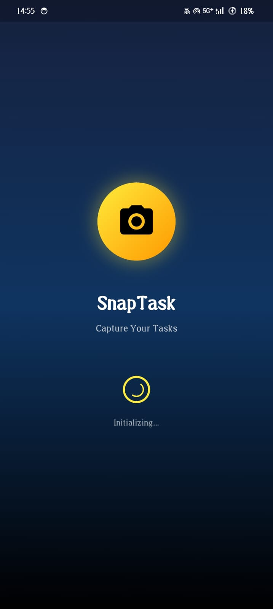
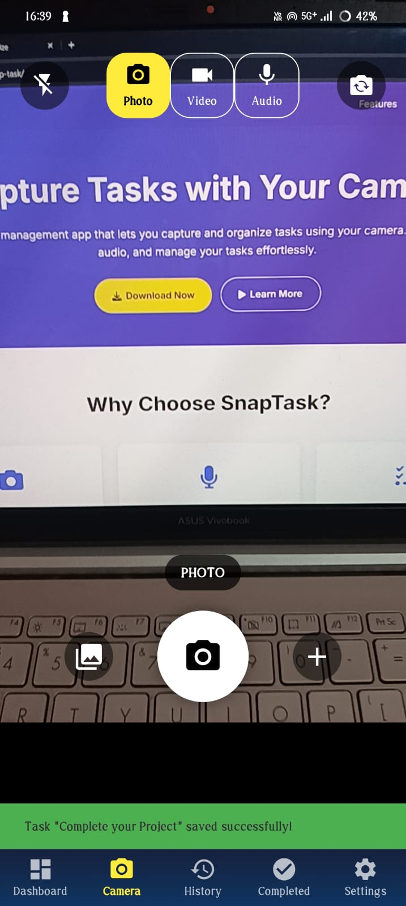
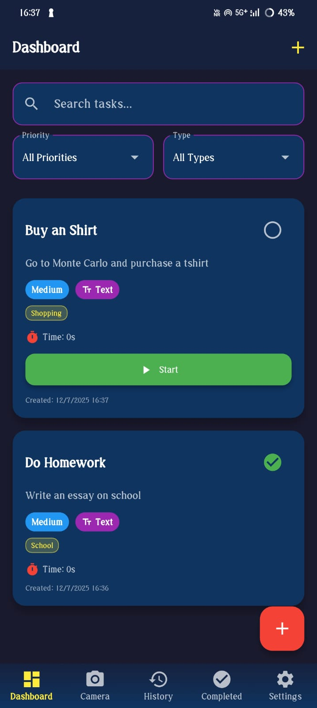
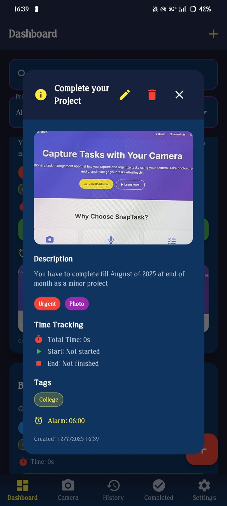
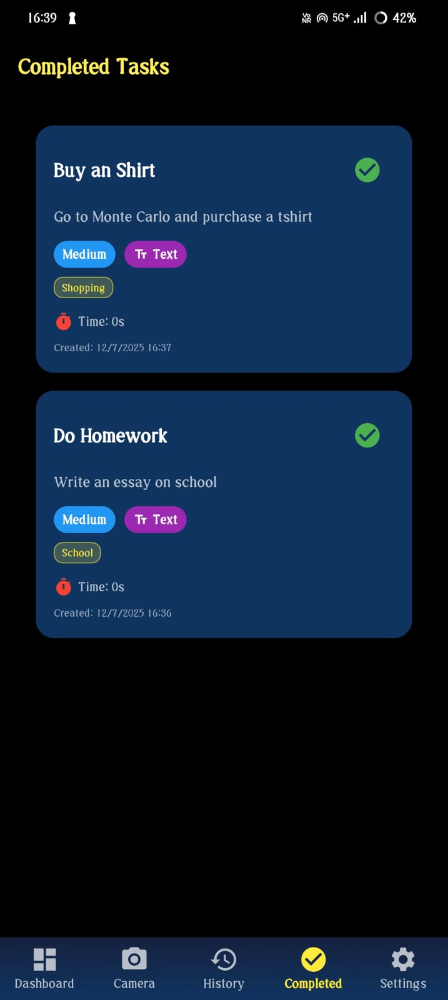
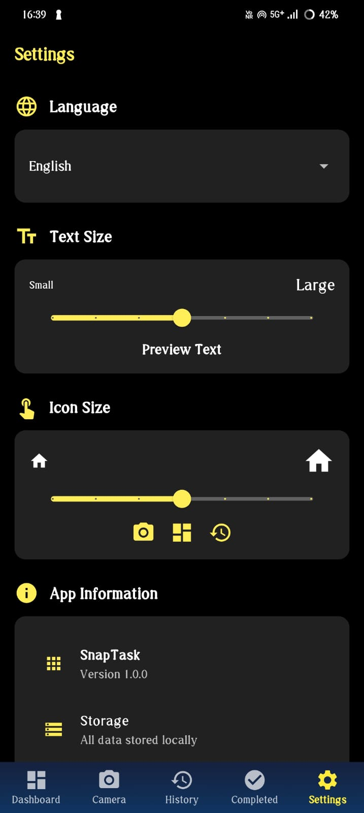

# 📸 SnapTask
### [*Try It Now !!!*](https://as6769-2004.github.io/snap-task/)

**Capture Tasks with Your Camera**

SnapTask is a revolutionary task management application that allows you to capture and organize tasks using your device's camera. Take photos, record audio, and manage your tasks effortlessly with an intuitive and modern interface.


## ✨ Features

### 📱 **Camera Integration**
- **Photo Capture**: Take photos of documents, whiteboards, or any visual task
- **Advanced Camera Controls**: Professional camera interface with zoom, focus, and flash controls
- **Image Preview**: Instant preview of captured images before saving

### 🎤 **Audio Recording**
- **Voice Notes**: Record audio descriptions for your tasks
- **High-Quality Audio**: Crystal clear audio recording with noise reduction
- **Audio Playback**: Listen to your recorded notes anytime

### 📋 **Task Management**
- **Smart Organization**: Automatically categorize and organize your tasks
- **Task History**: Keep track of completed tasks and your productivity
- **Edit & Delete**: Full control over your task data
- **Search & Filter**: Quickly find specific tasks

### 🔒 **Privacy First**
- **Local Storage**: All data stays on your device
- **No Cloud Required**: Complete privacy and control over your data
- **Secure**: Built with security best practices

### ⚡ **Performance**
- **Lightning Fast**: Optimized for speed and responsiveness
- **Cross-Platform**: Available on Android, iOS, and Web
- **Offline First**: Works without internet connection

## Screen Shorts
<p align="center">
  
  
  
  
  
  
</p>


## 🚀 Getting Started

### Prerequisites

- Flutter SDK (>=3.7.0)
- Dart SDK (>=3.0.0)
- Android Studio / VS Code
- Android SDK (for Android development)
- Xcode (for iOS development, macOS only)

### Installation

1. **Clone the repository**
   ```bash
   git clone https://github.com/yourusername/snaptask.git
   cd snaptask
   ```

2. **Install dependencies**
   ```bash
   flutter pub get
   ```

3. **Run the app**
   ```bash
   flutter run
   ```

### Building for Production

#### Android
```bash
flutter build apk --release
```

#### iOS
```bash
flutter build ios --release
```

#### Web
```bash
flutter build web --release
```

## 📱 Usage

### Taking Photos
1. Open the SnapTask app
2. Navigate to the Camera screen
3. Point your camera at the task you want to capture
4. Tap the capture button to take a photo
5. Add a title and description for your task
6. Save the task

### Recording Audio
1. Switch to audio recording mode
2. Tap the record button to start recording
3. Speak your task description
4. Tap again to stop recording
5. Add a title and save your task

### Managing Tasks
1. View all your tasks on the Dashboard
2. Tap on any task to view details
3. Edit or delete tasks as needed
4. Mark tasks as completed

## 🛠️ Development

### Project Structure

```
snaptask/
├── lib/
│   ├── models/          # Data models
│   ├── screens/         # UI screens
│   ├── services/        # Business logic
│   ├── widgets/         # Reusable widgets
│   └── main.dart        # App entry point
├── android/             # Android-specific files
├── ios/                 # iOS-specific files
├── web/                 # Web-specific files
└── pubspec.yaml         # Dependencies
```

### Key Dependencies

- **camera**: Camera functionality
- **video_player**: Video playback
- **image_picker**: Image selection
- **flutter_sound**: Audio recording
- **hive**: Local database
- **permission_handler**: Device permissions
- **provider**: State management

### Architecture

SnapTask follows a clean architecture pattern with:

- **Models**: Data structures and business logic
- **Services**: External interactions (camera, storage, permissions)
- **Screens**: UI components and user interactions
- **Widgets**: Reusable UI components

## 🔧 Configuration

### Permissions

The app requires the following permissions:

- **Camera**: For taking photos
- **Microphone**: For audio recording
- **Storage**: For saving media files

### Environment Setup

1. **Android**: Minimum SDK 21, Target SDK 34
2. **iOS**: Minimum iOS 12.0
3. **Web**: Modern browsers with camera support

## 🎨 Customization

### App Icon
The app uses a custom camera icon (`snap_task.png`) that can be modified in the `pubspec.yaml` file under the `flutter_launcher_icons` section.

### Theme
The app uses Material Design 3 with a custom color scheme. Colors can be modified in the theme configuration.

## 🐛 Troubleshooting

### Common Issues

1. **Camera not working**
   - Ensure camera permissions are granted
   - Check if camera is being used by another app

2. **Audio recording issues**
   - Grant microphone permissions
   - Check device audio settings

3. **Build errors**
   - Run `flutter clean` and `flutter pub get`
   - Ensure all dependencies are compatible

### Debug Mode
```bash
flutter run --debug
```

## 🤝 Contributing

We welcome contributions! Please follow these steps:

1. Fork the repository
2. Create a feature branch (`git checkout -b feature/amazing-feature`)
3. Commit your changes (`git commit -m 'Add amazing feature'`)
4. Push to the branch (`git push origin feature/amazing-feature`)
5. Open a Pull Request

### Development Guidelines

- Follow Flutter best practices
- Write clean, documented code
- Add tests for new features
- Update documentation as needed

## 📄 License

This project is licensed under the MIT License - see the [LICENSE](LICENSE) file for details.

## 🙏 Acknowledgments

- Flutter team for the amazing framework
- Camera plugin contributors
- Hive database team
- All open-source contributors

## 📞 Support

- **Email**: contact@snaptask.app
- **GitHub Issues**: [Report a bug](https://github.com/yourusername/snaptask/issues)
- **Documentation**: [Wiki](https://github.com/yourusername/snaptask/wiki)

## 🗺️ Roadmap

- [ ] Cloud sync support
- [ ] Task sharing
- [ ] Advanced filters
- [ ] Dark mode
- [ ] Widget support
- [ ] Voice commands
- [ ] AI-powered task categorization

---

**Made with ❤️ for productivity**

*SnapTask - Capture your tasks, organize your life*
